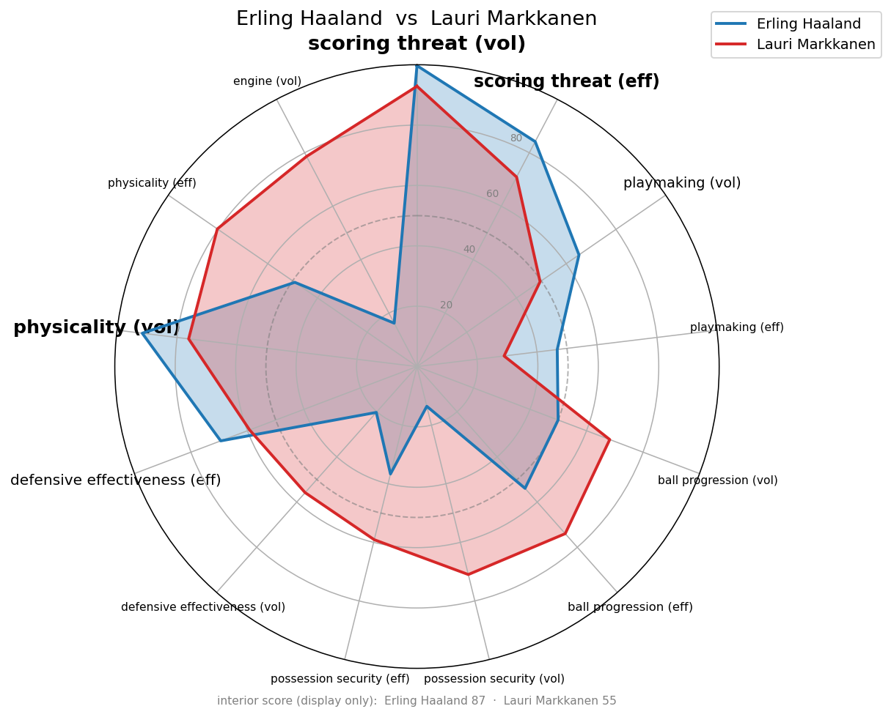
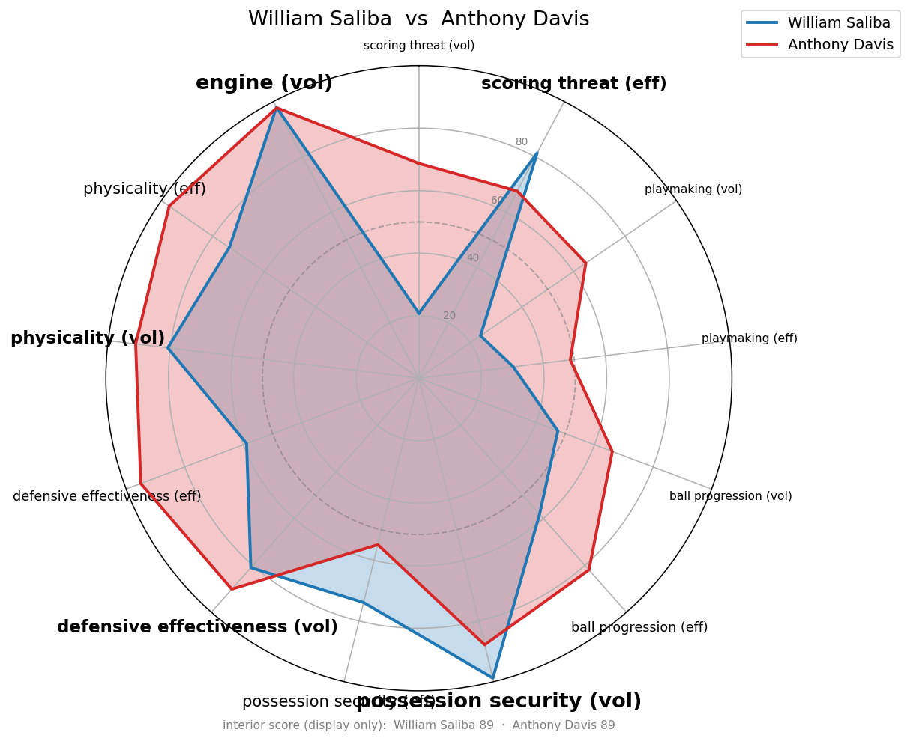
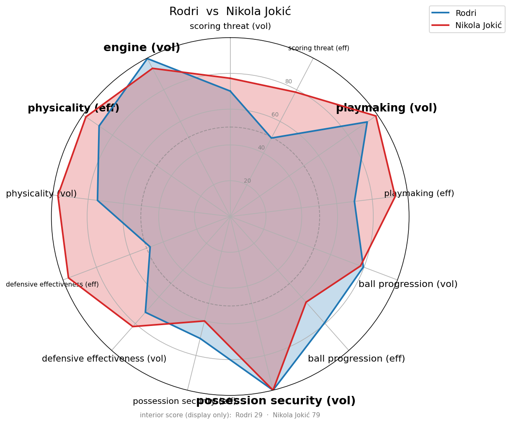
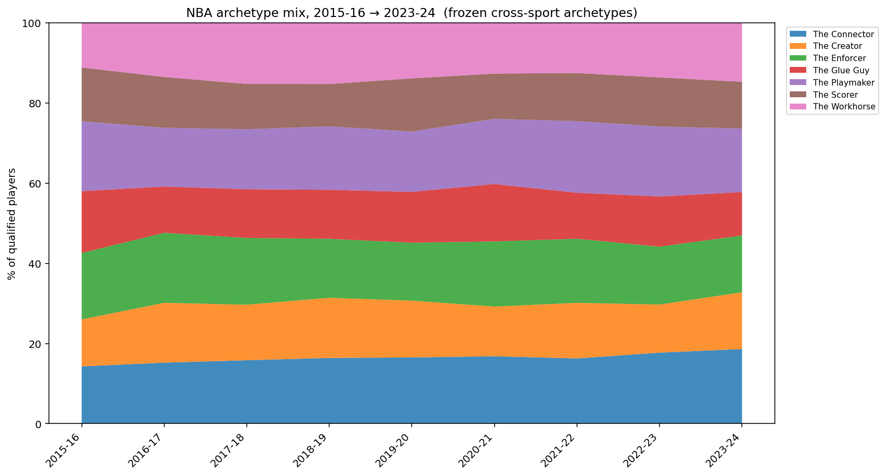
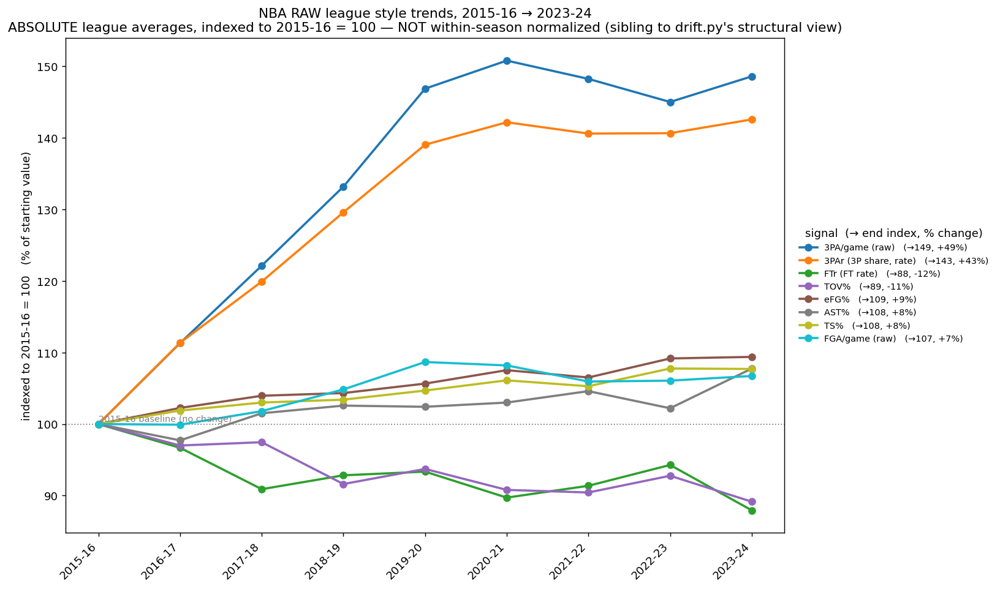
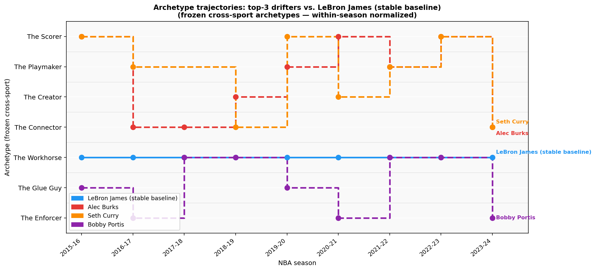

# Cross-Sport Similarity: Premier League ⇄ NBA

A model that asks "who is the NBA version of this footballer?" (and vice versa) by
scoring every player on the **same set of dimensions** and finding nearest
neighbours *across* sports. Mohamed Salah's closest NBA comp, Rodri's, Haaland's —
computed, not vibes.

The core problem is that soccer and basketball stats live in different units and
distributions. The bridge is **within-sport normalization**: every stat is turned
into a percentile rank *inside its own league-season* before any cross-sport
comparison happens, so "90th-percentile shot volume" means the same thing in both
sports even though the raw numbers don't.

## Example results

Three cross-sport comps, each player overlaid against their nearest NBA neighbour
on the seven dimension axes (dashed ring = league median; spoke size scales with
the query player's defining strengths):

| Erling Haaland → Lauri Markkanen | William Saliba → Anthony Davis | Rodri → Nikola Jokić |
|:---:|:---:|:---:|
|  |  |  |

### Discovered cross-sport archetypes (k=6)

Pooled k-means over both sports (`cluster.py`). Five of six clusters mix soccer and
NBA players — the validation that within-sport normalization makes the sports
comparable. Cluster 1 is NBA-only (a structural gap, not a GK artifact).
Full table: [`examples/archetypes_summary.csv`](examples/archetypes_summary.csv).

| # | Archetype (defining axes) | Soccer | NBA | Soccer exemplars | NBA exemplars |
|---|---|:---:|:---:|---|---|
| 0 | physicality | 77 | 73 | Ben Mee, Mathias Jørgensen, Levi Colwill | Onyeka Okongwu, Paul Reed, Daniel Theis |
| 1 | ball progression | 0 | 43 | — *(NBA-only)* | Duop Reath, Jaime Jaquez Jr., Kris Murray |
| 2 | playmaking | 59 | 61 | Mohammed Kudus, Harry Wilson, James Maddison | Malik Monk, Coby White, Austin Reaves |
| 3 | defensive effectiveness | 63 | 74 | Danilo, Declan Rice, Jefferson Lerma | Franz Wagner, Jalen Johnson, Aaron Gordon |
| 4 | scoring threat | 62 | 15 | Lyle Foster, Abdoulaye Doucouré, Jacob Bruun Larsen | Jerami Grant, Corey Kispert, Duncan Robinson |
| 5 | possession security + playmaking (eff) | 51 | 94 | Ibrahim Sangaré, Oliver Arblaster, Harrison Reed | Julian Champagnie, Shake Milton, Pat Connaughton |

## The dimensions

Players are scored on **7 core dimensions**, each split into a **volume** axis and
an **efficiency** axis (kept separate on purpose — averaging them re-introduces the
"high-usage inefficient scorer looks like a low-usage sniper" failure mode):

| Dimension | What it captures |
|---|---|
| `scoring_threat` | Shot volume + finishing efficiency, with **shot location** folded in (interior vs perimeter) |
| `playmaking` | Chance creation, assists, passing into dangerous areas |
| `ball_progression` | Moving the ball/possession up the field or court |
| `possession_security` | Ball retention, turnover avoidance |
| `defensive_effectiveness` | Tackles/steals/blocks, interceptions, defensive reliability |
| `physicality` | What you're *built* like — height, weight, BMI, aerial/rebound duels |
| `engine` | How much you *motor* — recoveries, hustle activity |

`config.py` defines the dimension → stat mapping per sport; this is the single
place to re-wire which raw columns feed each axis.

### Build index (physicality)

Bio measurements (height, weight) drive a **BMI-based "build" signal** —
imperial `BMI = 703 · weight_lbs / height_in²`. This is the mass-for-frame read:
a 5'8"/170 lb compact player scores denser/stronger than a 6'0"/140 lb lanky one,
exactly as intended. A manual `ALIAS_FBREF_TO_FIFA` map in `ingest_data.py`
bridges players whose FBref display name shares no token with their FIFA
registered name (e.g. Rodri → "Rodrigo Hernández Cascante").

### Shot location

Where a player scores from is folded into `scoring_threat` efficiency rather than
living as its own axis (a standalone interior axis dragged high-volume scorers
toward low-usage putback centers). A **display-only `interior_score`** (0–100) is
also computed for the radar/breakdown readout so location is still visible:
- NBA: low 3PAr + high FTr → high interior (Giannis ≈ 92, Curry ≈ 37)
- Soccer: close average shot distance + high non-penalty xG/shot

## Matching

`similarity.py` ranks cross-sport nearest neighbours. The default
**strengths-weighting** weights each axis by how far *above* the league median the
query player sits — so players match on what they're distinctively **good at**,
not on shared absences (fixes "Haaland matches low-usage shooters because they're
both bad defenders"). Euclidean by default; Mahalanobis and cosine available.

## Archetype clustering

`cluster.py` pools both sports into one space and runs k-means (k chosen by
silhouette, 6–8) to discover **cross-sport archetypes** — clusters that mix soccer
and NBA players are the thesis made literal. Goalkeepers are dropped (no
cross-sport analogue). The soccer/NBA split per cluster is the validation headline:
mixed clusters mean the normalization genuinely makes the sports comparable.

## Pipeline

```
ingest_data.py   raw league/bio CSVs  →  soccer.csv, nba.csv  (wide merged tables)
pipeline.py      filter by minutes → within-sport normalize → 7 dimension axes
similarity.py    weighted cross-sport nearest-neighbour ranking
breakdown.py     per-axis "close HOW?" comparison between two players
radar.py         overlaid radar chart of two players across the axes
cluster.py       pooled k-means → archetype_assignments.csv
config.py        dimension schema (the one place to re-wire stats → axes)
drift.py         frozen archetypes + structural drift over 9 NBA seasons (v2)
era_trends.py    raw league-average style trends over time (v2)
```

Run order: `python ingest_data.py` → then any of `similarity.py`, `radar.py`,
`cluster.py`, `drift.py`, `era_trends.py`.

---

## v2: multi-season NBA analysis

### Data

Nine NBA seasons (2015-16 through 2023-24), all sourced from `nba_api` (one
consistent source, `nbaapi_*_<YYYY>.csv`). Each season is ingested via
`ingest_data.py` and stored as `processed/nba_<id>.csv`. The fetch scripts
(`fetch_nba_base.py`, `fetch_nba_tracking.py`, `fetch_nba_bio.py`) are
orchestrated by `fetch_all_seasons.py`.

**Provenance fix:** the original `NBA_Stats_Per_Game_2023*.csv` files from
Basketball-Reference were mislabeled — they contain 2023-24 data, not 2022-23
(verified via LeBron per-game spot-check, correlation 1.0). That bbref source is
retired. The `nba_2223` dataset ID now maps to genuine 2022-23 data from nba_api.

### Two-lens design

The v2 analysis answers two distinct questions using two modules that must stay
separate — they are *complements*, not redundant:

| Module | Question | Normalization |
|---|---|---|
| `drift.py` | Are role archetypes *re-sorting* over time? | Within-season percentile ranks → blind to uniform tides |
| `era_trends.py` | How has the league *absolutely* changed? | None — raw league averages → sees the tides directly |

### Archetype drift (`drift.py`)

Pools EPL 2023-24 + all 9 NBA seasons (3,535 player-seasons) into one space,
fits **one** `StandardScaler` + k-means (k=7), and **freezes** the scaler and
centroids to `archetypes_frozen.pkl`. Every player-season is then assigned to the
nearest frozen centroid — the scaler is never re-fit.

Validation results:
- ✅ **Traditional-big share falls** (−7pp combined across the two physical archetypes 2015-16 → 2023-24)
- ✅ **Assignment is stable**: LeBron → one archetype for all 9 seasons; Curry → one archetype for all 8; Gobert stays in the physicality cluster with one adjacent-cluster flicker
- ⚠️ The **3-point revolution is not visible here** — by design. Within-season percentile ranks erase any shift that lifts everyone equally. Use `era_trends.py` for that signal.

**Stacked-area chart of NBA archetype composition drift:**



### Era trends (`era_trends.py`)

Raw league averages across qualified players (minutes ≥ 500) per season. All
rate/share signals — `3PAr = 3PA/FGA`, `FTr = FTA/FGA`, `TS%`, `eFG%`, `TOV%`,
`AST%` — plus raw `3PA/game` alongside `3PAr` so the pace contribution is
explicit. Chart indexes every signal to 2015-16 = 100 so mixed-scale signals
don't flatten each other.

Headline results (2015-16 → 2023-24):

| Signal | 2015-16 | 2023-24 | Change |
|---|---:|---:|---:|
| 3PAr (3P shot share) | 0.282 | 0.402 | **+42.6%** |
| 3PA/game (raw) | 2.38 | 3.53 | +48.6% |
| FGA/game (raw) | 8.39 | 8.96 | +6.7% ← pace contribution |
| FTr (FT rate) | 0.270 | 0.237 | −12.1% |
| TOV% | 10.7 | 9.5 | −10.9% |
| eFG% | 0.502 | 0.549 | +9.4% |
| TS% | 0.537 | 0.578 | +7.7% |

The 3-point rate story: `3PA/game` grew +48.6% but `FGA/game` only grew +6.7%,
so almost the entire raw rise is the *rate* (the league's deliberate choice to
shoot threes) rather than pace/volume.

**All signals indexed to 2015-16 = 100:**



### Player trajectory analysis (`trajectories.py`)

`trajectories.py` loads the frozen archetype assignments directly (no re-clustering)
and surfaces how individual players moved through the 7 archetypes across their
careers. For every player with 5+ qualifying seasons it computes archetype transitions,
distinct archetypes visited, A→B→A return patterns, and most common archetype, writing
a full summary to `examples/player_trajectories.csv` (603 rows).

**The stable baseline:** LeBron James, Stephen Curry, and Giannis Antetokounmpo each
hold exactly one archetype across all seasons they qualify for — LeBron and Giannis as
The Workhorse (9/9), Curry as The Playmaker (8/8). The model sees their defining
identity immediately and never wavers.

**The top drifters** (ranked by season-to-season transitions) are genuine role
chameleons whose archetype changes map to real career events, not noise:
- **Alec Burks** — 9 seasons, 4 archetypes, 7 transitions. Career journeyman across
  Utah, Cleveland, Sacramento, Golden State, New York, Detroit and more; his role
  flipped repeatedly from off-ball scorer to primary ball-handler as teams deployed
  him differently.
- **Seth Curry** — 8 seasons, 4 archetypes, 7 transitions. Pure shooter (The Scorer)
  periodically asked to act as a secondary playmaker in Dallas and Philadelphia; his
  oscillation between Scorer, Playmaker, and Connector tracks real team-specific role
  changes across multiple trades.
- **Bobby Portis** — 9 seasons, 3 archetypes, 6 transitions. Physical reserve big in
  Chicago who cycled between Glue Guy and Enforcer before finding a defined identity
  in Milwaukee as a high-usage sixth-man; late-career consolidation to Workhorse/
  Enforcer mirrors his emergence as a real offensive weapon.

**Cross-sport spot-check** (EPL players assigned via the same frozen archetypes):
- **Erling Haaland → The Scorer** — textbook; highest shot volume and best finishing
  rate in the league. His centroid distance (3.96) is the highest of any named player,
  honestly reflecting that he's an extreme outlier even within his own archetype.
- **Rodri → The Workhorse** — surprising at first glance given his playmaking radar,
  but the cross-sport pool pulls him toward The Workhorse on his defensive engine and
  ball-recovery volume. An honest consequence of cross-sport coarseness: the 7-archetype
  space compresses Rodri's full profile into the dimension he shares most robustly with
  NBA counterparts.

**Trajectory chart (top-3 drifters vs. LeBron as stable baseline):**



### Local interactive comparison tool (`embed_data.py` → `compare.html`)

`embed_data.py` bakes all 3,562 player-seasons (EPL 2023-24 + 9 NBA seasons) into a
single self-contained HTML file with no server or dependencies required:

```
python embed_data.py        # writes compare.html (~1.6 MB)
open compare.html           # open in any browser
```

The tool lets you pick any two players (both sports, all seasons) and renders three
SVG radar panels: Player A solo, Player B solo, and a full-width overlay with both
profiles superimposed. Each radar covers all 13 dimension axes (7 dimensions × vol/eff,
plus engine volume) with percentage grid lines at 25/50/75/100. An interior score badge
(0–100) shows shot location tendency for each selected player.

`compare.html` is **not committed** (it contains baked-in processed data) but can be
regenerated from the pipeline at any time by running `embed_data.py`.

---

## Data provenance & licensing

**Data files are NOT included in this repository** — they're large and/or not ours
to redistribute. The code expects these inputs locally (all git-ignored):

| Data | Source | Seasons |
|---|---|---|
| EPL player stats (`PL_Stats_2023*.csv`, 7 tables) | FBref | **2023–24** |
| NBA per-game + advanced (`nbaapi_base_<YYYY>.csv`) | nba_api | **2015-16 → 2023-24** |
| NBA tracking / hustle (`nbaapi_tracking_<YYYY>.csv`) | nba_api | **2015-16 → 2023-24** |
| NBA bio height/weight (`nbaapi_bio_<YYYY>.csv`) | nba_api | **2015-16 → 2023-24** |
| Soccer bio height/weight (`soccer_bio_2023.csv`) | FIFA 23 dataset (Hugging Face) | **FIFA 23** |

> ⚠️ **EPL bio gap:** a handful of 2023-24 EPL arrivals (Mitoma, Mainoo, Quansah,
> Son, Tomiyasu, Endo) have no FIFA-23 row (the 2022 game predates their moves) and
> run on aerials-only physicality.

## Requirements

Python 3 with `pandas`, `numpy`, `scipy`, `scikit-learn`, `matplotlib`, `nba_api`.

```
pip install pandas numpy scipy scikit-learn matplotlib nba_api
```
